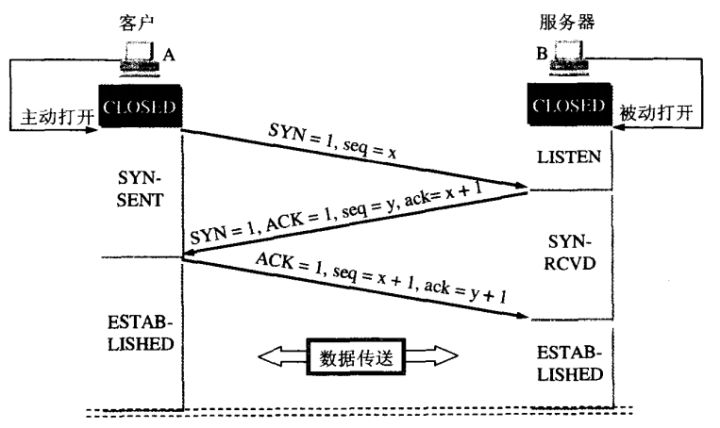
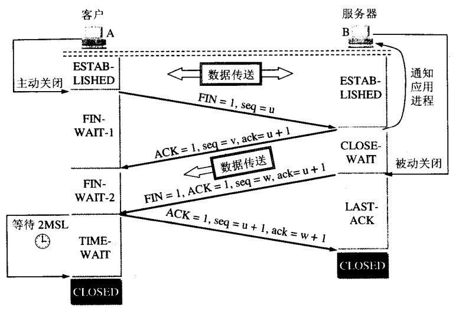
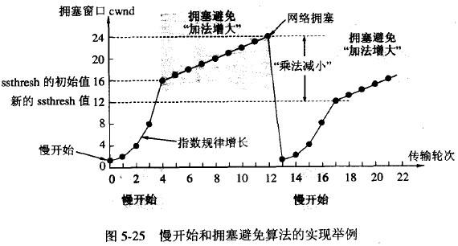

# 1 TCP 传输控制协议
传输层建立在网络层之上，无法提供可靠的传输，因此需要TCP自行采取对应的措施才能是传输层之间的通信变得可靠

对于网络中的报文大多有一个共同点，组成包含首部+数据。上层的报文有作为一个整体当作下层报文的数据。比如：
TCP：TCP首部+TCP报文数据段
IP：IP首部+IP报文数据（包含TCP报文）

## 1.1 TCP的可靠原理
理想传输条件：
1）传输信道不产生差错
2）不管发送方以多快的速度发送数据，接收方总是来及处理收到的数据

### 1.1.1 停止等待协议
发送方A，接收方B，B收到A发送的数据时需要进行反馈确认，A在收到确认之前不可以删除上一个数据，收到确认后发送下一个。若等待超时则进行超时重传

缺点：信道利用率太低

### 1.1.2 连续ARQ协议
发送方存在发送窗口，在收到接收方对第i个分组确认后，可以将窗口向前滑动。接收方采用累积确认，对按序到达的最后一个分组发送确认。

缺点：不能正确反映接收方收到的所有分组。如发送方发了5个分组，而第3个分组丢了，第4和第5个分组其实都已收到，但只能确认第2个分组。（GBN）

### 1.1.3 选择重传协议
相对于GBN，只重发真正丢失的分组

## 1.2 TCP三次握手和四次握手
### 1.2.1 三次握手
#### 为什么需要第三次握手？
防止已经失效的连接请求报文突然又传送到了B，因而产生错误。假定A发送的一个请求因为网络原因滞留，以致于延误到连接释放之后才到达，B会误认为A又发起了一次请求，若没有第三次握手，在B发出确认后连接就建立了。但事实上A并没有发起连接，B一直在傻等空等A的数据，B的资源就这样白白浪费了。
### 1.2.2 四次握手
A先向B请求关闭，进入半关闭状态，现在B还可以向A发送。
B再向A请求关闭。
#### 为什么要等待2MSL
1）防止A最后发送的ACK报文丢失，一旦发生丢失B会进行重传，但若此时A已经进入CLOSED状态，则会导致B无法进入CLOSED状态
2）使本连接持续的时间内所产生的所有报文段都从网络中消失，使下一个新的连接中不会出现这种旧的连接请求报文段

<figure class="half">
    
    
</figure>

## 流量控制
防止发送方发送速率太快，接收方来不及接受。发送方维护自身发送窗口的大小，不能超过接收窗口

## 拥塞控制
与流量控制的接受方窗口限制相比，拥塞控制的瓶颈问题是网络资源紧张导致的，如网络流量过大影响数据在网络链路中的流动。
### 拥塞控制算法
1）慢开始
2）拥塞避免
3）快重传
4）快恢复

cwnd< ssthresh 慢开始算法，拥塞窗口翻倍：1->2->4->8
cwnd> ssthresh 拥塞避免，拥塞窗口加一：9->10->11->12

快重传不再等待超时计时器，而是收到三个重复确认之后就进行重传。
快恢复与慢开始不一样，当收到三个重复确认后，将ssthresh设为cwnd的一半，cwnd设新的ssthresh（慢开始是将cwnd设为1）

<figure class="half">
    
    
</figure>

## 拥塞窗口与发送窗口
发送方的发送窗口等于拥塞窗口，甚至小于拥塞窗口